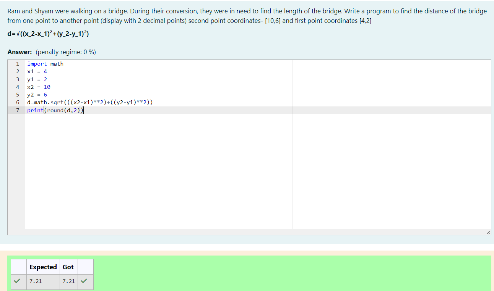

# DISTANCE-BETWEEN-TWO-POINTS
NAME : RAMYA.P
REG NO : 212223240137
DEPT : AIML

## AIM:
To write a python program to find the distance two 2 points
## ALGORITHM:
### Step 1: 
Get the input from the user
### Step 2:
Get the inputs from the user for the coordinates of the first point (x_1,x_2) and the second point (y_1,y_2).
### Step 3: 
Substitute the values in the distance formula  
### Step 4: 
Then get the outut
### Step 5: 
End of the program
### PROGRAM:
```
#Program to find the distance between two points.
#Developed by: RAMYA.P
#RegisterNumber:212223240137

import math
x1 = 4
y1 = 2
x2 = 10
y2 = 6
d=math.sqrt(((x2-x1)**2)+((y2-y1)**2))
print(round(d,2))
```
### OUTPUT:
[output](/)

### RESULT:
Thus the distance between two points output was verified successfully
